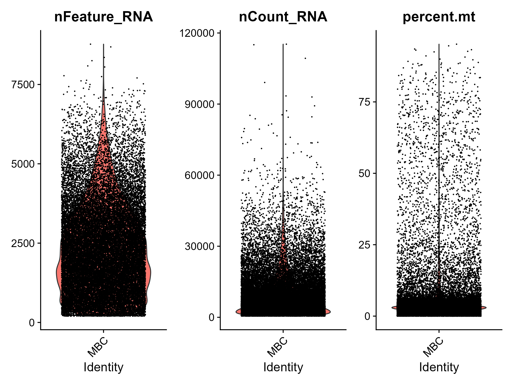
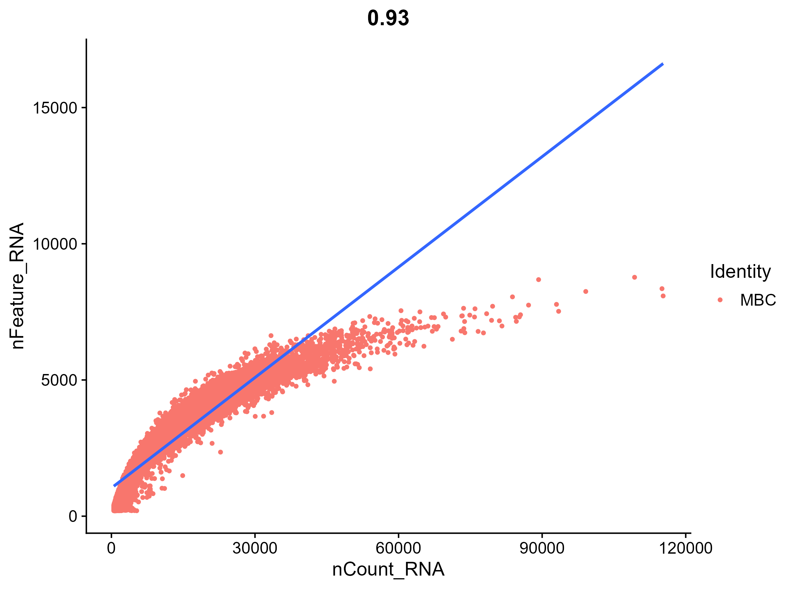
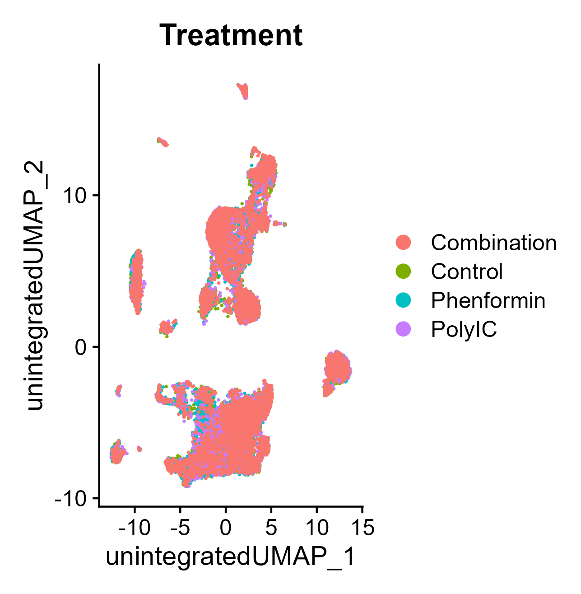

# Single-cell RNA-Seq Analysis Project 

This repository contains a workflow for single-cell RNA-seq analysis, including quality filtering, batch effect using R

---

## Project Overview

The goal of this project is to analyse single-cell RNA-seq data murine breast cancer tumor to study the effect of TLR activation combined with complex I inhibition on promoting tumoricidal effect of neutrophils. The workflow includes:

---

## Folder Structure

---
## Dataset Overview

**Source:** GEO accession GSE272922  
**Publication:** John Heath et al. ,Complex I inhibition combined with TLR activation in the breast tumor microenvironment educates cytotoxic neutrophils.Sci. Adv.11,eadu5915(2025).DOI:10.1126/sciadv.adu5915  
**Organism:** Mus musculus  
**Cell Lines:** Murine breast tumors  
**Treatments:** Saline+PBS, Saline+Phenformin, Poly I:C+PBS, Poly I:C+Phenformin  
**Condition:** Control, TLR activated, Complex I inhibited and combined treatment  
**Sequencing:** Illumina NovaSeq 6000 (Mus musculus)  

---
## QC and filtering

  
  
   
  <b>Figure 1: Data was filtered for cells with 200 < nFeature_RNA < 5000 and percent.mt < 10% </b>

The hump of the violin plot and deviation from the line occurs around 5000 features. Thus the data was filtered below 200 and above 5000 features while keeping gene with mitochondrial content at limit of 10%.

## Batch effect

  
   
  <b>Figure: Unintegrated UMAP colored by Treatment.</b>

The unintegrated UMAP show unbiased clustering across treatments. Therefore integration of data is skipped.

## Clustering 